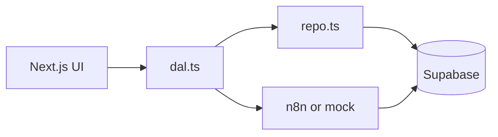

# MeelPrep — agent guide

Daily meal planner (HITL): fill slots → generate names → review → shopping list. **Next.js is a thin UI.** **Supabase is the source of truth.** **n8n** (or the local mock) owns generation logic.

Read this file first. Deep dives live in [`docs/ai/`](docs/ai/README.md). Human-facing overview: [`README.md`](README.md). Living product plan: [`docs/plan.md`](docs/plan.md).

---

## Quick start

```bash
pnpm install
cp .env.example .env.local   # fill Supabase + N8N_WEBHOOK_URL
pnpm dev
```

- Package manager: **pnpm** only (not npm).
- Default dev URL is often **3001** if 3000 is taken.
- Run migrations in order in the Supabase SQL editor: `0001_init.sql` → `0002_recipes_write.sql` → `0003_shopping_used_for.sql`.
- Without Supabase env, `src/data/repo.ts` falls back to an in-memory store (UI still works).

| Env | Role |
| --- | --- |
| `NEXT_PUBLIC_SUPABASE_URL` | Project URL |
| `NEXT_PUBLIC_SUPABASE_PUBLISHABLE_KEY` | Browser/SSR key (`ANON_KEY` fallback OK) |
| `SUPABASE_SERVICE_ROLE_KEY` | Server-only writes past RLS (optional but helps mock/n8n) |
| `N8N_WEBHOOK_URL` | Mock (`…/api/mock-n8n`) or live n8n webhook |
| `DEMO_USER_ID` | Must match seeded profile in `0001_init.sql` |

---

## Architecture (non‑negotiables)

1. **Thin UI** — Server Actions in `src/app/actions/` persist to Postgres and POST one webhook. No OpenAI calls in React or Route Handlers except the mock processor.
2. **Supabase = truth** — Menus, meals, jobs, shopping lists. UI reads a `PlannerDTO` from `src/data/dal.ts` → `src/data/repo.ts`.
3. **Two-phase AI** — `generate_menu` / `regenerate_meals` fill **names only**. `generate_shopping` runs **after approve** (or skip-to-shop when the board is already full).
4. **Generate never overwrites filled slots** — Only `source=empty` cells go to n8n.
5. **Dirty names** — If `display_name` ≠ `recipes.name`, do not reuse old `recipe_ingredients` for shopping.
6. **Contracts are typed** — `src/lib/n8n/contracts.ts` is the single webhook shape. Mock and live n8n must write the **same columns**.



---

## Repository map

| Path | Purpose |
| --- | --- |
| `src/app/page.tsx` | RSC home; `?menu=` selects a menu |
| `src/app/actions/menu.ts` | Settings, generate, regenerate, approve, favorites, **New menu** (redirect) |
| `src/app/actions/shopping.ts` | Manual shopping items |
| `src/app/api/mock-n8n/route.ts` | Local webhook stand-in |
| `src/proxy.ts` | Next.js 16 session refresh (not `middleware.ts`) |
| `src/components/planner/` | Board, AI panel, history select, review, shopping |
| `src/data/dal.ts` | Job orchestration, `emitN8nJob`, error recovery |
| `src/data/repo.ts` | All Supabase reads/writes; in-memory fallback |
| `src/lib/n8n/` | `contracts`, `client`, `handlers`, `catalog` |
| `src/lib/supabase/` | Typed clients, `database.types.ts`, env helpers |
| `supabase/migrations/` | Schema + RLS (run manually in dashboard today) |

Key UX (current):

- **History** — compact `<select>` above AI panel (`HistoryPanel.tsx`).
- **Skip generation** — when every slot is filled on a draft, AI panel shows **Build shopping list** (`isBoardFilled` in `menu-utils.ts`).
- **Shopping labels** — `shopping_list_items.used_for text[]`; UI shows meal names under each ingredient; repo rehydrates from recipes when n8n omits the column.

---

## Menu status flow

| Status | UI |
| --- | --- |
| `draft` | Plus slots + AI panel; may skip to shop if full |
| `generating` | Disabled controls; poll + Realtime; 10s timeout → recover |
| `review` | Rename, select, regenerate, approve |
| `approved` / `shopping` | Planning locked; shopping panel; history + New menu |

**New menu:** archive current (unless already blank draft), create draft, **`redirect(/?menu=<id>)`** — do not only `revalidatePath("/")` or the old menu reloads.

---

## n8n / mock

- Client: `src/lib/n8n/client.ts` — if URL contains `/api/mock-n8n`, runs `processN8nJob` in-process via `after()`.
- Live n8n: POST JSON with `action` ∈ `generate_menu` | `regenerate_meals` | `generate_shopping`.
- Header: `x-webhook-secret` when `N8N_WEBHOOK_SECRET` is set.
- **PostgREST filters in n8n:** separate `eq` conditions per field — not SQL strings like `uuid and slot=dinner`.
- **Prompts:** JSON-only; stringify objects; never send full ingredient lists to the LLM on `generate_menu`.
- **Shopping writes:** set `used_for` to meal display names (Postgres `text[]`), e.g. `["Greek salad","Roast chicken"]`.

Details: [`docs/ai/n8n.md`](docs/ai/n8n.md).

---

## Supabase

- Demo user via `current_app_user_id()` when no Auth UI.
- Favorites need `0002_recipes_write.sql` (insert name-only recipes).
- Realtime on `menus`, `menu_meals`, `shopping_lists` for active `menu_id`.
- `service_role` must never be imported in client components.

Details: [`docs/ai/supabase.md`](docs/ai/supabase.md).

---

## Verify after changes

```bash
pnpm lint
pnpm build
```

Manual smoke (with Supabase + dev server):

1. Empty draft → fill slot manually → **Build shopping list** appears when all slots filled.
2. Partial board → **Generate empty slots** only fills empties.
3. Review → approve → shopping list with `(meal names)` under ingredients when recipes linked.
4. **New menu** → URL changes to new `?menu=` and history select matches.
5. History select switches menus without stale board.

---

## Do not

- Replace `src/app/page.tsx` with unrelated templates.
- Commit `.env.local`, service role keys, or `.cursor/settings.json`.
- Use `npm install` / `npm` scripts.
- Put business logic or LLM calls in client components.
- Overwrite filled `menu_meals` on generate.
- Skip updating **README.md** and **docs/plan.md** when behavior, schema, or env changes (see `.cursor/rules/docs-sync.mdc`).

---

## Documentation duty

When you ship a user-visible or architectural change, update in the **same PR / session**:

1. [`README.md`](README.md) — status, setup, features reviewers care about.
2. [`docs/plan.md`](docs/plan.md) — as-built scope, todos, risks.
3. [`docs/ai/`](docs/ai/README.md) — if n8n contracts, schema, or flows changed.

---

## Next.js note

<!-- BEGIN:nextjs-agent-rules -->

# This is NOT the Next.js you know

This version has breaking changes — APIs, conventions, and file structure may all differ from your training data. Read the relevant guide in `node_modules/next/dist/docs/` (resolved from this file's directory; in monorepos the `next` package may not be visible from the repo root) before writing any code. Heed deprecation notices.

This block is written and re-added by `next dev` — verify at `node_modules/next/dist/server/lib/generate-agent-files.js`. Removing it from a diff only re-creates the uncommitted change; committing it with your work keeps the tree clean.

<!-- END:nextjs-agent-rules -->
