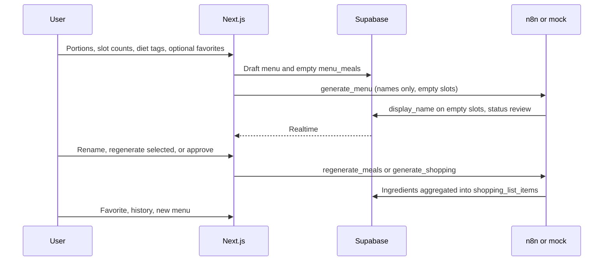

# MeelPrep

A daily meal planner with a human in the loop: pick favorites, generate the rest, approve names, then get a shopping list.

MeelPrep is a portfolio project for **AI automation / full-stack** roles. It shows a product people can actually use, not a chatbot wrapped in a landing page. Next.js is a thin UI. [Supabase](https://supabase.com/) is the source of truth. [n8n](https://n8n.io/) (or a local mock with the same contract) does generation.

---

**Problem.** Meal planning is a repeatable process: preferences in, a menu out, then a grocery list. Most “AI meal” demos dump a wall of text and stop. That is not how people cook or shop.

**What the user does**

1. Set portions, how many breakfasts / dinners / suppers they need, and diet tags (vegetarian, high protein, gluten free, and so on).
2. Optionally fill slots from favorites or type a dish name. AI is asked only for the empty slots.
3. Review suggested **names** (not full recipes). Rename, drop, or regenerate selected meals with a note such as “no broccoli, more protein.”
4. Approve. Only then does the system build a categorized shopping list, scaled to portions, with room for extra items.
5. Heart meals to reuse next time. **New menu** archives the current plan and opens a blank draft. History keeps past menus and lists.

---

### Architecture



- **Thin UI.** Server Actions persist settings and enqueue a `generation_jobs` row, then POST JSON. They do not call OpenAI.
- **Source of truth.** Menus, meals, recipes, favorites, and shopping lists live in Postgres. The board is a DTO over those tables.
- **Two-phase generation.** Review is names only. Shopping is a second job: reuse `recipe_ingredients` when the name still matches; otherwise treat it as a miss.
- **Swap orchestration without changing the app.** Set `N8N_WEBHOOK_URL` to the mock or to a production n8n webhook. Payloads are typed in [`src/lib/n8n/contracts.ts`](src/lib/n8n/contracts.ts).

The local mock (`src/app/api/mock-n8n` and in-process `after()` when the URL contains `/api/mock-n8n`) fills names from a static catalog and aggregates ingredients. **pgvector columns and HNSW indexes are in the schema** so a real workflow can embed and search `recipes` / `ingredients` without a migration. The mock does not call embeddings or OpenAI.

### Stack

| Layer             | Choice                                                                               |
| ----------------- | ------------------------------------------------------------------------------------ |
| UI                | Next.js 16 (App Router), React 19, Tailwind CSS 4                                    |
| Data              | Supabase (Postgres, RLS, Realtime, `pgvector`)                                       |
| Orchestration     | n8n webhook, or local mock with the same writes                                      |
| Auth (this slice) | Seeded demo user; RLS helper `current_app_user_id()` falls back until Auth UI exists |

### Repository map

```
src/app/page.tsx                 RSC: load planner DTO (?menu= optional)
src/app/actions/               Server Actions (menu + shopping)
src/app/api/mock-n8n/          Same table writes as the real webhook
src/proxy.ts                   Session refresh (Next.js 16)
src/components/planner/       Board, AI panel, review, shopping, history
src/data/dal.ts                Job orchestration (server-only)
src/data/repo.ts               Supabase repository; in-memory fallback
src/lib/n8n/                   Contracts, client, mock handlers, catalog
src/lib/supabase/              Typed SSR / browser / admin clients
supabase/migrations/          Schema, RLS, Realtime publication
```

### Data model (short)

Full DDL: [`supabase/migrations/0001_init.sql`](supabase/migrations/0001_init.sql). Follow-ups: [`0002_recipes_write.sql`](supabase/migrations/0002_recipes_write.sql) (favorites), [`0003_shopping_used_for.sql`](supabase/migrations/0003_shopping_used_for.sql) (meal labels on shopping items).

| Table                                            | Role                                                                |
| ------------------------------------------------ | ------------------------------------------------------------------- |
| `menus`                                          | One prep batch: portions, meals per slot, diet tags, HITL `status`  |
| `menu_meals`                                     | One cell per (slot, position); `display_name` is what the user sees |
| `recipes` / `recipe_ingredients` / `ingredients` | Shared cache for shopping merge; optional `embedding vector(1536)`  |
| `user_favorites`                                 | Reuse without calling generation                                    |
| `shopping_lists` / `shopping_list_items`         | Categorized list after approve; `is_manual` for extras; `used_for text[]` lists which meals need each ingredient |
| `generation_jobs`                                | Audit + UI “generating…” even if Realtime lags                      |

Generate **never overwrites** filled slots. Changing `display_name` away from `recipes.name` must not reuse the old ingredient rows.

### Webhook contract

One POST body, switched on `action`. Shared secret header `x-webhook-secret`. Do not send instructions or ingredient lists to the model.

`generate_menu` (names, empty slots only):

```json
{
  "job_id": "uuid",
  "menu_id": "uuid",
  "user_id": "uuid",
  "action": "generate_menu",
  "portions": 4,
  "diet_tags": ["vegetarian", "high_protein"],
  "filled": [
    {
      "slot": "breakfast",
      "position": 0,
      "name": "Overnight oats",
      "recipe_id": "…"
    }
  ],
  "empty": [{ "slot": "dinner", "position": 0 }]
}
```

`regenerate_meals` sends selected ids, `keep_names`, and an optional note. `generate_shopping` sends current names and portions; n8n loads cached ingredients from the database.

---

## Run locally

Requires Node.js 20+, [pnpm](https://pnpm.io/), and a Supabase project.

```bash
pnpm install
cp .env.example .env.local
```

Fill `.env.local` (see [`.env.example`](.env.example)):

| Variable                               | Purpose                                            |
| -------------------------------------- | -------------------------------------------------- |
| `NEXT_PUBLIC_SUPABASE_URL`             | Project URL                                        |
| `NEXT_PUBLIC_SUPABASE_PUBLISHABLE_KEY` | Anon / publishable key (`ANON_KEY` still works)    |
| `SUPABASE_SERVICE_ROLE_KEY`            | Server-only; mock/n8n inserts that RLS would block |
| `N8N_WEBHOOK_URL`                      | Default: this app’s `/api/mock-n8n`                |
| `N8N_WEBHOOK_SECRET`                   | Optional; mock checks the header when set          |
| `DEMO_USER_ID`                         | Must match the seeded profile                      |

In the Supabase SQL editor, run migrations in order:

1. `supabase/migrations/0001_init.sql`
2. `supabase/migrations/0002_recipes_write.sql`
3. `supabase/migrations/0003_shopping_used_for.sql`

```bash
pnpm dev
```

Open `/`. Without Supabase env, the repository falls back to an in-memory store so the UI still runs.

Point `N8N_WEBHOOK_URL` at a live n8n production webhook when the workflow implements the same three actions. Keep “Respond When: last node finishes” (or equivalent) so the UI does not time out before database writes.

---

## Status

**In this repo today:** HITL board, typed n8n contracts, Supabase schema/RLS, local mock, Realtime, history select, new-menu drafts with redirect, skip-to-shop when the board is full, shopping list with meal labels on shared ingredients.

**Designed, not in this repo:** n8n workflow JSON export, OpenAI calls, embedding cache-hit in n8n, login UI, weekly calendar, recipe instructions, calories.

**Agent & AI docs:** [`AGENTS.md`](AGENTS.md) · [`docs/ai/`](docs/ai/README.md) · living plan [`docs/plan.md`](docs/plan.md)

---

Amadeusz Kozlowski · 2026
