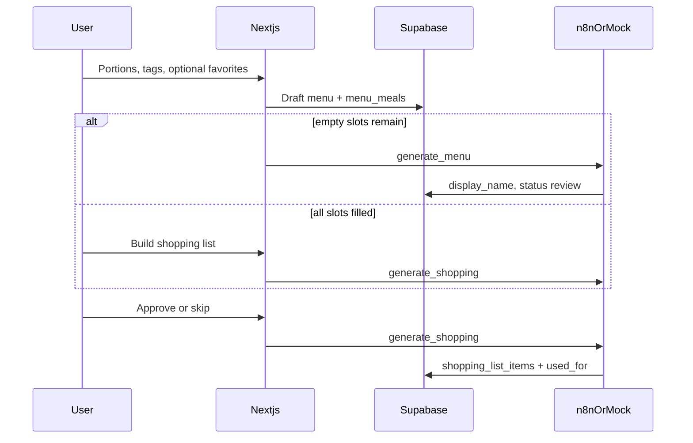

# Meal planner — living plan

**As-built HITL meal planner.** Next.js is a thin UI. Supabase is the source of truth. n8n (or the local mock) fills names then shopping lists.

Keep this file aligned with shipped behavior. Mirror significant updates in [`README.md`](../README.md). Agent onboarding: [`AGENTS.md`](../AGENTS.md).

---

## Shipped

- [x] SQL schema + RLS + pgvector columns (`0001_init.sql`)
- [x] Name-only recipe writes for favorites (`0002_recipes_write.sql`)
- [x] Shopping item meal attribution (`0003_shopping_used_for.sql`)
- [x] Typed Supabase clients + demo user fallback
- [x] Homepage: Breakfast / Dinner / Supper board, AI panel, HITL review, shopping
- [x] Typed n8n contracts + local mock (`/api/mock-n8n`)
- [x] Favorites picker + manual dish names on plus slots
- [x] Generate sends **empty slots only**; filled favorites preserved
- [x] Realtime + polling while jobs run; 10s timeout recovery
- [x] Menu history as compact **select** above AI panel
- [x] **New menu** archives current and **redirects** to `/?menu=<new-id>`
- [x] **Skip generation** — fully filled draft → **Build shopping list**
- [x] Shopping list: categories, manual extras, copy; **ingredient → meal labels** (`used_for` + recipe rehydrate)
- [x] Live n8n webhook supported via `N8N_WEBHOOK_URL` (user workflow outside repo)

## In progress / next

- [ ] n8n workflow: always populate `shopping_list_items.used_for` on aggregate
- [ ] pgvector cache-hit in n8n (embed + search before LLM)
- [ ] Supabase Auth UI (RLS helper already supports `auth.uid()`)
- [ ] Weekly calendar, recipe instructions, calories — out of scope for v1

## Architecture (summary)

Two-phase AI: **names during review**, **ingredients after approve**.

## UX states

| Status | UI |
| --- | --- |
| `draft` | Plus grid, AI panel; may show Build shopping list when full |
| `generating` / meal `regenerating` | Disabled controls, pulse |
| `review` | Select, note, regenerate, approve |
| `approved` / `shopping` | Shopping panel; planning locked |

## Risks & gotchas

- Mock and n8n must write the **same columns** or the UI misleads.
- Dirty `display_name` must not reuse old `recipe_ingredients`.
- `revalidatePath("/")` without changing `?menu=` reloads the wrong menu.
- Favoriting without `0002` fails RLS on `recipes`.
- n8n PostgREST filters: separate `eq` conditions, not SQL strings.
- Service role never in client bundle.

## File map

See [`AGENTS.md`](../AGENTS.md) and [`docs/ai/README.md`](./ai/README.md).
